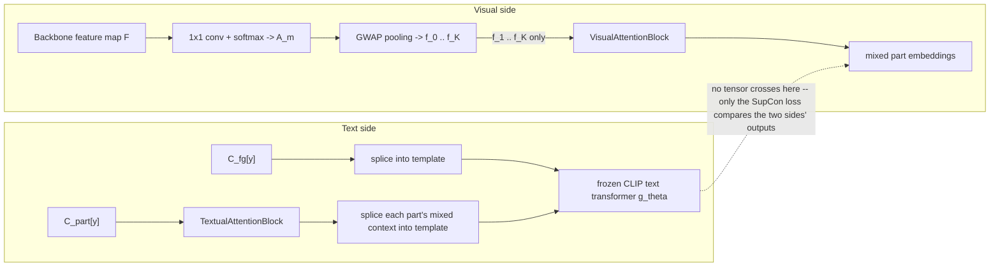

# Methodology: Part-Aware, Semantically-Regularized, Domain-Adaptive Person Re-Identification

This document describes the training methodology implemented in this repository (`pcr`). The
system combines three techniques from the literature into a single pipeline:

1. **BPBreID** (Somers et al., WACV 2023) — attention-based body-part feature pooling with
   visibility-aware masking (GiLt).
2. **CLIP-ReID** (Li et al., AAAI 2023) — two-stage prompt learning that uses a frozen CLIP text
   encoder as a training-time semantic regularizer, generalized here from a single per-identity
   prompt to one prompt per (identity, body part).
3. **SPCL** (Ge et al., NeurIPS 2020) — self-paced contrastive learning with a hybrid memory bank,
   used as the unsupervised domain-adaptation strategy.

The three components are composed sequentially: BPBreID defines the feature space (a global
branch plus $K$ part branches, each with a visibility score); CLIP-ReID regularizes that feature
space during supervised pre-training via natural-language semantic anchors; SPCL then adapts the
resulting encoder to an unlabeled target domain.

---

## 1. Notation

| Symbol | Meaning |
|---|---|
| $I$ | An input image |
| $F \in \mathbb{R}^{C\times H\times W}$ | Backbone feature map for $I$ |
| $K$ | Number of learned body parts (default $K=5$) |
| $M = K+1$ | Number of branches (index $0$ = foreground/global, $1..K$ = parts) |
| $A_m \in \mathbb{R}^{H\times W}$ | Spatial attention map for branch $m$ |
| $f_m \in \mathbb{R}^{D}$ | Pooled, L2-normalized embedding for branch $m$ ($D=512$ by default) |
| $v_m \in \{0,1\}$ or $[0,1]$ | Visibility score for branch $m$ (binary or continuous) |
| $y_i$ | Identity label of sample $i$ (real label for source/supervised data, pseudo-label for target data under domain adaptation) |
| $\tau$ | Softmax temperature |
| $[\cdot]_+$ | $\max(\cdot, 0)$ |

---

## 2. Part-Based Visual Encoder

### 2.1 Pixel-to-Part Attention

Given backbone features $F$, a $1{\times}1$ convolution followed by a channel-wise softmax
produces a per-pixel distribution over $M$ branches:

$$
S = \mathrm{Conv}_{1\times1}(F) \in \mathbb{R}^{M \times H \times W}, \qquad
A_m(h,w) = \frac{\exp\big(S_m(h,w)\big)}{\sum_{m'=1}^{M} \exp\big(S_{m'}(h,w)\big)}
$$

Attention is learned end-to-end from the downstream training signal (identity, triplet, and
alignment losses) rather than supervised by external pose/parsing masks — no external body-part
labels are required at inference time. An optional pixel-wise cross-entropy term (§3.4) can
additionally supervise $A$ when ground-truth part masks are available for a given dataset.

### 2.2 Global-Weighted Average Pooling (GWAP)

Each branch's embedding is a mask-weighted average of the backbone feature map, normalizing by
the mask's own sum (not the pixel count), so that partially-attended branches are not
systematically down-weighted:

$$
f_m = \mathrm{L2Norm}\!\left(\frac{\sum_{h,w} A_m(h,w)\, F(h,w)}{\sum_{h,w} A_m(h,w) + \epsilon}\right)
$$

### 2.3 Visibility Scoring

Two modes are supported. In the binary mode (default at both train and test time), a branch is
"visible" if it wins the arg-max at any spatial location:

$$
v_m = \max_{h,w}\ \mathbb{1}\!\left[\arg\max_{m'} A_{m'}(h,w) = m\right]
$$

In the continuous mode, visibility is the branch's peak soft-attention weight:

$$
v_m = \max_{h,w} A_m(h,w)
$$

Visibility gates every downstream loss and distance computation in Stage 3 (§5) and in the base
GiLt/BPA losses generally: an invisible branch contributes zero to identity/triplet losses for
that sample, and zero to any inter-sample distance or similarity that would otherwise compare
against it. Stage 1/2's CLIP-relational pipeline (§3, §4) instead applies visibility as a single
upstream *candidate-acceptance* filter on the training set (§3.5.2) — once an image is accepted,
every branch contributes unconditionally to every loss term for that image, with no further
per-branch gating inside the loss itself.

---

## 3. Stage 1 — Per-Part Prompt Learning

Stage 1 trains a set of learnable natural-language prompts, one per (identity, branch) pair, to
serve as fixed semantic anchors for Stage 2. The visual encoder and the CLIP text encoder are
**both frozen** in this stage; only the prompt context vectors are trainable.

### 3.1 Prompt Construction

For identity $y$ and branch $m$, a prompt is assembled around a fixed natural-language template
with $M_{ctx}$ learnable context tokens ($M_{ctx}=4$):

$$
p_{y,m} = \big[\,\mathrm{SOT},\ \texttt{"a photo of a"},\ \underbrace{[V_1]_{y,m}, \dots, [V_{M_{ctx}}]_{y,m}}_{\text{learnable}},\ \texttt{"person"},\ \mathrm{EOT}\,\big]
$$

The $M_{ctx}$-token context block $[V_\cdot]_{y,m}$ comes from one of two learnable tensors,
depending on whether $m$ is the foreground branch or a part branch:

- **Foreground** ($m=0$): $[V_\cdot]_{y,0} = C_{fg}[y] \in \mathbb{R}^{M_{ctx}\times 512}$, read
  directly off a learnable tensor $C_{fg} \in \mathbb{R}^{N_{id}\times M_{ctx}\times 512}$.
- **Parts** ($m=1..K$): $[V_\cdot]_{y,m} = \mathrm{TAB}\big(C_{part}[y]\big)_m$, where
  $C_{part} \in \mathbb{R}^{N_{id}\times K \cdot M_{ctx}\times 512}$ is a second learnable tensor
  and $\mathrm{TAB}$ (TextualAttentionBlock, §3.5) is a bidirectional self-attention block run once per
  identity, jointly over all $K$ part branches' context tokens, **before** any individual part's
  prompt is spliced together. This is the mechanism by which each part's prompt is informed by the
  other parts, rather than being learned in isolation.

$C_{fg}$ and $C_{part}$ (together with TAB's attention weights) are the only trainable parameters
of this stage; the surrounding template tokens are frozen CLIP vocabulary embeddings shared across
all identities and branches.

### 3.2 Frozen Text Encoder

The assembled prompt embedding sequence $p_{y,m}$ is passed through CLIP's (frozen) text
transformer $g_\theta$ to obtain a text embedding:

$$
t_{y,m} = \mathrm{L2Norm}\big(g_\theta(p_{y,m})\big) \in \mathbb{R}^{512}
$$

$g_\theta$'s weights ($\theta$) are never updated during any stage.

### 3.3 Supervised Contrastive Alignment Loss

On the visual side, the $K$ part embeddings $\{f_{i,1},\dots,f_{i,K}\}$ pooled by GWAP (§2.2) are
likewise mixed once through a bidirectional self-attention block over the part axis —
$\mathrm{VAB}$ (VisualAttentionBlock, §3.5), a zero-initialized residual gate so it starts as an
identity map and only learns to mix as training progresses:

$$
\tilde f_{i,1..K} = f_{i,1..K} + \tanh(g)\cdot \mathrm{VAB}_{\mathrm{enc}}(f_{i,1..K}), \qquad g \in \mathbb{R}\ \text{learnable, } g_0 = 0
$$

The foreground embedding $f_{i,0}$ is left untouched by VAB (only the $K$ part branches are mixed;
see §3.5's rationale for excluding the foreground branch from both relation blocks).

For a mini-batch of images, each branch's (possibly VAB-mixed) visual embedding is aligned against
the corresponding identity's text embedding $\{t_{y_i,m}\}$ using a **multi-positive** supervised
contrastive loss (not vanilla InfoNCE — every same-identity pair in the batch is a positive, not
only the same-index pair), following the identity-mask formulation used in CLIP-ReID:

$$
\mathcal{L}_{i2t}^{(m)} = -\frac{1}{|\mathcal{B}|}\sum_{i \in \mathcal{B}}
\frac{1}{|P(i)|}\sum_{p \in P(i)} \log
\frac{\exp\big(\tilde f_{i,m}\cdot t_{y_p,m} / \tau\big)}{\sum_{k} \exp\big(\tilde f_{i,m}\cdot t_{y_k,m} / \tau\big)},
\qquad P(i) = \{k : y_k = y_i\}
$$

with $\tau = 1.0$. The loss is applied symmetrically ($\mathcal{L}_{i2t}+\mathcal{L}_{t2i}$, swapping
the roles of image and text features) and summed over every branch, for every image in the batch —
unlike earlier revisions of this pipeline, there is no per-branch visibility threshold inside this
loss. Visibility instead acts once, upstream, as a dataset-level accept/reject filter before
training ever begins (§3.5.2), so every image reaching this loss already has all $M$ branches
usably visible:

$$
\mathcal{L}_{\text{Stage1}} = \sum_{m=0}^{M-1} \big(\mathcal{L}_{i2t}^{(m)} + \mathcal{L}_{t2i}^{(m)}\big)
$$

At the end of Stage 1, a frozen lookup table of per-identity, per-branch text prototypes
$\bar{T} \in \mathbb{R}^{N_{id}\times M \times 512}$ is pre-computed once (via
`examples/cache_text_anchors.py`, run once as a separate script after Stage 1 finishes — recomputing
this deterministic, frozen forward pass on every Stage-2 step would be wasted work) and cached for
Stage 2, which also loads VAB's Stage-1-trained weights as its own starting point (§4).

### 3.4 Algorithm 1 — Prompt Learning

```
Input:  frozen visual encoder E_phi, frozen CLIP text encoder g_theta,
        raw training set D_raw = {(I_i, y_i)}, num identities N_id, K part branches
Output: learned context (C_fg, C_part), trained VAB, TAB (TAB discarded after Stage 1)

1:  D <- filter_by_visibility(D_raw, E_phi, lambda_v_min)   # upstream accept/reject, see 3.5.2
2:  Initialize C_fg ~ N(0, 0.02^2), C_part ~ N(0, 0.02^2)    # trainable, fp32
3:  Initialize VAB (zero-init gate), TAB
4:  # Cache visual features once (no repeated encoder forward passes)
5:  for each (I_i, y_i) in D:
6:      (f_i, v_i) <- E_phi(I_i)                        # [M, D], [M], no_grad
7:      store (f_i, v_i, y_i)
8:  for epoch = 1 .. E1:
9:      for each random mini-batch B of cached samples:
10:         t_fg    <- g_theta(splice(C_fg[y]))          for y in B's labels
11:         part_ctx <- TAB(C_part[y])                    for y in B's labels  # mix across K parts
12:         t_part[m] <- g_theta(splice(part_ctx[:, m]))  for m = 0..K-1
13:         f_part <- VAB(f_{.,1..K})                     # mix visual K parts the same way
14:         loss <- SupCon(f_{.,0}, t_fg) + sum_m SupCon(f_part[:,m], t_part[m])   # symmetric i2t+t2i, every branch, every sample
15:         update (C_fg, C_part, VAB, TAB) by gradient descent on loss   # E_phi, g_theta frozen
16: return (C_fg, C_part), VAB, TAB     # cache_text_anchors.py separately builds T_bar from these
```

---

### 3.5 Design Note: Attention Maps Never Reach the Text Encoder, and How Cross-Part Context Is Shared Instead

**Why not feed the spatial attention maps $A_m$ (§2.1) into the text encoder?** Two structural
reasons, unchanged by the relation blocks added below:

1. **Modality mismatch.** $A_m$ is a per-pixel spatial map over the *image's* $H\times W$ grid.
   CLIP's text transformer $g_\theta$ has no positional structure that corresponds to image
   pixels — it consumes a sequence of token embeddings, not a spatial field. There is no
   architecturally sound way to splice a $H\times W$ map into a 77-token sequence.
2. **Direction of supervision.** The prompts are meant to be a fixed, image-independent semantic
   anchor per (identity, branch) — that's what makes $\bar T$ usable as a frozen classifier weight
   in Stage 2 (§4.3). If $A_m$ (which is itself trained by the same losses that use $\bar T$) fed
   back into the prompt, the anchor would depend on the very attention it's meant to regularize,
   defeating the purpose of using a frozen, externally-derived semantic space as a regularizer.

So the only thing bridging the visual and text sides is the *scalar routing* of the pixel-attention
mechanism — which pooled vector $f_m$ (§2.2) counts as "branch $m$" — not the attention weights
themselves. `pcr/models/bpbreid_encoder.py::BPBReIDEncoder` and `pcr/models/clip_text_encoder.py
::ClipTextEncoder` remain two independent forward passes with no tensor crossing between them.



**What the relation blocks add, without crossing that boundary.** Both BPBreID's part pooling and
CLIP's own text transformer have a structural gap that a naive per-part treatment leaves
unaddressed, and the two relation blocks close it independently on each side:

- BPBreID's $K$ pooled part vectors $f_1,\dots,f_K$ (§2.2) are produced by $K$ independent
  weighted averages — there is no term anywhere in GWAP that lets "left arm" and "torso" influence
  each other's pooled embedding. `VisualAttentionBlock` (`pcr/models/relation_blocks.py`) adds one
  bidirectional `nn.TransformerEncoder` layer over the $K$ part tokens (batch dimension
  unaffected), so each part's final embedding can attend to every other part's, before either
  loss or distance computation sees it.
- CLIP's text transformer applies a **causal** attention mask internally (standard GPT-style
  left-to-right), so within one prompt, later context tokens can attend to earlier ones but not
  vice versa. Generalizing to $K$ separate part prompts compounds this: with no additional
  mechanism, each part's context tokens are optimized in complete isolation from every other
  part's — there is no path, causal or otherwise, for "person is carrying a bag" learned in one
  part's context to inform another part's. `TextualAttentionBlock` runs *before* $g_\theta$, as a
  bidirectional pass over all $K$ parts' raw context tokens flattened together, so the causal
  encoder that follows starts from context that already reflects the other parts, rather than
  fixing the asymmetry after the fact.

Both blocks operate purely on the $K$ part branches' own representations (context vectors on the
text side, pooled embeddings on the visual side) — never on $A_m$ itself, and never on the
foreground branch (excluded per §0.1 of the design plan, which frames foreground inclusion as
optional rather than the base case). `VisualAttentionBlock` uses a learned, zero-initialized
residual gate ($\tanh(g)$, $g_0=0$) so training starts as if it were absent and only learns to mix
if doing so helps; it remains active at inference. `TextualAttentionBlock` has no such gate — it is
owned internally by `PromptLearner`, trains only in Stage 1, and is discarded once $\bar T$ is
cached (§3.3), so its output is baked into $\bar T$'s numbers rather than run again later.

#### 3.5.1 Actual Code Path

```python
# pcr/models/prompt_learner.py -- PromptLearner.build_part_prompts(labels)
fg = self._splice(self.fg_ctx[labels])                 # foreground: untouched by TAB
raw_part_ctx = self.part_ctx[labels]                    # [B, K*n_ctx, dim]
mixed_part_ctx = self.tab(raw_part_ctx)                 # bidirectional mix across K parts
parts = [self._splice(mixed_part_ctx[:, k*n_ctx:(k+1)*n_ctx, :]) for k in range(K)]
return [fg] + parts                                      # M=1+K prompt tensors, one g_theta() call each
```

```python
# pcr/models/relation_blocks.py -- VisualAttentionBlock.forward(part_tokens)
relation_out = self.encoder(part_tokens)                 # bidirectional TransformerEncoder over K tokens
return part_tokens + torch.tanh(self.gate) * relation_out # zero-init residual gate
```

#### 3.5.2 Upstream Visibility Filtering (Replaces Per-Branch Masking)

Because occlusion handling is out of scope for this design (images are assumed pre-filtered, not
robustly handled end-to-end), neither relation block nor either stage's loss does any per-sample,
per-branch masking. Instead, `pcr/utils/visibility_filter.py::filter_by_visibility` computes a
scalar visibility index per image — the mean of BPBreID's own part-visibility scores $v_1,\dots,v_K$
(§2.3), excluding the foreground branch — and rejects any image below a threshold
$\lambda_{v\_min}$ *before* Stage 1's feature cache or Stage 2's training loader is built:

$$
\mathrm{VisIndex}(I) = \frac{1}{K}\sum_{m=1}^{K} v_m(I), \qquad \text{keep } I \iff \mathrm{VisIndex}(I) \ge \lambda_{v\_min}
$$

This is a strictly simpler mechanism than the branch-conditional masking used elsewhere in the
repo's other stages (`pcr/loss/gilt_loss.py`'s GiLt split, Stage 3's visibility-gated distance in
§5): rather than every loss term needing to know which branches are usable for which sample, every
sample admitted past this filter is treated as fully visible everywhere downstream.

---

## 4. Stage 2 — Supervised Backbone Fine-Tuning

Stage 2 trains the full visual encoder $E_\phi$ (backbone + attention head) with real identity
labels. Stage 1's prompts and the CLIP text encoder are frozen; only $\bar{T}$ (as a fixed lookup
table) is used, as the target of an alignment loss. `VisualAttentionBlock` (§3.5) is the one
exception to "Stage 1 outputs are frozen here": it continues training jointly with $E_\phi$,
initialized from Stage 1's weights, and its output — not the raw per-branch pooled embeddings —
feeds all four loss terms below. As in Stage 1 (§3.5.2), the training set is filtered once
upstream by visibility index before this loop begins; none of the four losses does its own
per-branch visibility gating. Four loss terms are combined.

### 4.1 Identity Loss

A persistent linear classifier $W_0 \in \mathbb{R}^{N_{id}\times D}$ is applied to the foreground
branch, with label smoothing ($\epsilon=0.1$):

$$
\mathcal{L}_{id} = -\sum_{c=1}^{N_{id}} q_c \log \mathrm{softmax}\big(W_0 f_{i,0}\big)_c,
\qquad q_c = (1-\epsilon)\,\mathbb{1}[c=y_i] + \frac{\epsilon}{N_{id}}
$$

Following BPBreID's own weighting convention, identity loss is applied to the foreground branch
only; part branches are not separately classified.

### 4.2 Part-Triplet Loss

A batch-hard triplet loss (Hermans et al., 2017), applied across **all** branches (foreground plus
VAB-mixed parts) jointly. `pcr/loss/part_triplet_loss.py::PartTripletLoss` supports an optional
per-branch visibility weighting, but Stage 2 does not use it (`parts_visibility=None`) — since the
upstream filter (§3.5.2) already guarantees every admitted sample has every branch usably visible,
per-branch distances are combined by a plain unweighted average rather than the visibility-weighted
average used elsewhere in the repo (e.g. Stage 3, §5, where no such upstream filter exists):

$$
d(i,j) = \frac{1}{M}\sum_{m=0}^{M-1} \lVert f_{i,m}-f_{j,m}\rVert_2
$$

$$
\mathcal{L}_{tri} = \sum_{a \in \mathcal{B}}
\Big[\alpha + \max_{p:\,y_p=y_a} d(a,p) - \min_{n:\,y_n\neq y_a} d(a,n)\Big]_+, \qquad \alpha = 0.3
$$

### 4.3 Text-Prototype Alignment Loss

For every branch (no visibility gate — §3.5.2), the visual embedding is classified against the
*entire* frozen prototype table as if it were a fixed linear classifier — this is a cross-entropy
loss, not a cosine-similarity regression, following CLIP-ReID's actual Stage-2 formulation:

$$
\mathcal{L}_{align}^{(m)} = -\sum_{c=1}^{N_{id}} q_c \log
\mathrm{softmax}\big(f_{i,m} \cdot \bar{T}_{:,m}^{\top}\big)_c ,
\qquad \mathcal{L}_{align} = \sum_{m=0}^{M-1} \mathcal{L}_{align}^{(m)}
$$

### 4.4 Body-Part Attention (BPA) Loss (optional)

When ground-truth part masks are available for a dataset, an auxiliary pixel-wise cross-entropy
term directly supervises the attention logits $S$ (§2.1) against a mask-derived per-pixel label
$\hat{c}(h,w) \in \{0,\dots,K\}$:

$$
\mathcal{L}_{BPA} = -\frac{1}{HW}\sum_{h,w} \log \mathrm{softmax}\big(S(h,w)\big)_{\hat{c}(h,w)}
$$

This term is dataset-conditional (only applied where masks exist on disk) and is not required for
the attention mechanism to train — it is a source of additional supervision when available.

### 4.5 Total Objective

$$
\mathcal{L}_{\text{Stage2}} = \lambda_{id}\,\mathcal{L}_{id} + \lambda_{tri}\,\mathcal{L}_{tri}
+ \lambda_{align}\,\mathcal{L}_{align} + \lambda_{BPA}\,\mathcal{L}_{BPA}
$$

with defaults $\lambda_{id}=1.0,\ \lambda_{tri}=1.0,\ \lambda_{align}=0.5,\ \lambda_{BPA}=0.35$
(the last only active when masks are supplied).

### 4.6 Algorithm 2 — Supervised Fine-Tuning

```
Input:  encoder E_phi (init. from ImageNet or an external checkpoint),
        VAB (init. from Stage 1's trained weights), frozen prototype table T_bar,
        raw labeled training set D_raw, identity classifier W_0
Output: fine-tuned encoder E_phi*, continued-training VAB*

1:  D <- filter_by_visibility(D_raw, E_phi, lambda_v_min)   # upstream accept/reject, see 3.5.2
2:  for epoch = 1 .. E2:
3:      for each PK-sampled mini-batch B (P identities x K instances) from D:
4:          (f, v) <- E_phi(images(B))                       # [B, M, D], [B, M]
5:          f_combined <- concat(f[:,0:1], VAB(f[:,1:]))      # foreground untouched, parts mixed
6:          L_id  <- CrossEntropyLS(W_0 f_combined[:,0], y)
7:          L_tri <- BatchHardTriplet(f_combined, y)          # unweighted average, no visibility arg
8:          L_align <- 0
9:          for m = 0 .. M-1:
10:             L_align <- L_align + CrossEntropy(f_combined[:,m] . T_bar[:,m]^T, y)   # every branch, no skip
11:         L_bpa <- BPA(S, mask_targets)   if masks available else 0
12:         L <- lambda_id*L_id + lambda_tri*L_tri + lambda_align*L_align + lambda_bpa*L_bpa
13:         update E_phi, VAB (and W_0) by gradient descent on L
14:     evaluate mAP/CMC on the held-out query/gallery split
15: return E_phi*, VAB*
```

---

## 5. Stage 3 — Self-Paced Unsupervised Domain Adaptation

Stage 3 adapts $E_\phi$ (initialized from Stage 2's checkpoint, or an externally-pretrained one)
to an unlabeled target domain, given a labeled source domain, following SPCL's self-paced
hybrid-memory strategy generalized per-branch.

### 5.1 Domain-Specific Batch Normalization (DSBN)

Every BatchNorm layer in $E_\phi$ is replaced by a domain-specific pair
$\{\mathrm{BN}_S, \mathrm{BN}_T\}$. During training, a joint batch
$[x_S; x_T]$ (source images first, target images second, in equal numbers) is split by position
at every BatchNorm layer:

$$
\mathrm{DSBN}(x) = \big[\mathrm{BN}_S(x_{[1:B/2]})\,;\ \mathrm{BN}_T(x_{[B/2+1:B]})\big]
$$

At test time, only $\mathrm{BN}_T$ is used.

### 5.2 Hybrid Memory and Contrastive Loss

A single memory bank $\Phi \in \mathbb{R}^{(N_S + N_T)\times M \times D}$ holds one slot per source
*class* (initialized as the class centroid) and one slot per target *instance*. For an embedding
$f$ with memory index $y$ (a source class id, or a target instance index), the per-branch
similarity to every slot is computed and combined via a visibility-weighted average across
branches, then a masked softmax groups slots sharing the same (real or pseudo-) label $\ell$:

$$
\mathcal{L}_{hm}(f, y) = -\log \frac{\exp\big(\mathrm{sim}(f,\Phi_y)/\tau\big)}
{\sum_{\ell} \exp\big(\overline{\mathrm{sim}}(f, \Phi)_\ell /\tau\big)}, \qquad \tau = 0.05
$$

Memory slots are updated by exponential moving average after each batch, per branch, skipping the
update for any branch invisible in that sample (never blending in a zero/garbage embedding):

$$
\Phi_{y,m} \leftarrow \mathrm{L2Norm}\big(\mu\, \Phi_{y,m} + (1-\mu)\, f_{m}\big)
\quad \text{if } v_m = 1, \qquad \mu = 0.2
$$

### 5.3 Jaccard Re-Ranking and Clustering

At each epoch, a base distance $d(i,j)$ between target instances is computed (§4.2's formula,
applied to the memory's target slots), refined via $k$-reciprocal Jaccard re-ranking, and
clustered with DBSCAN ($\varepsilon=0.6$) to assign each target instance a pseudo-label.

### 5.4 Self-Paced Reliability Estimation

Two auxiliary clusterings are computed at looser and tighter DBSCAN thresholds
($\varepsilon\pm0.02$). For each instance $i$, let $\mathcal{I}(i)$, $\mathcal{I}^{tight}(i)$,
$\mathcal{I}^{loose}(i)$ be the sets of instances sharing $i$'s cluster under the base, tight, and
loose clusterings respectively. Independence and compactness scores are defined as:

$$
R_{indep}(i) = 1 - \frac{|\mathcal{I}(i)\cap \mathcal{I}^{loose}(i)|}{|\mathcal{I}(i)\cup \mathcal{I}^{loose}(i)|},
\qquad
R_{comp}(i) = 1 - \frac{|\mathcal{I}(i)\cap \mathcal{I}^{tight}(i)|}{|\mathcal{I}(i)\cup \mathcal{I}^{tight}(i)|}
$$

A cluster's reliability is the minimum $R_{indep}$ (resp. $R_{comp}$) over its members. Instances
in clusters below the reliability threshold (the 90th percentile of $R_{indep}$ among the current
epoch's clusters) are re-labeled as singleton outliers rather than discarded, so the memory still
tracks them individually while the contrastive loss trusts them less.

### 5.5 GiLt and BPA Carry-Over

The identity loss (§4.1, via the persistent classifier $W_0$) and the part-triplet loss (§4.2) are
carried over into this stage **unchanged**: identity loss uses source's real labels only, while
triplet loss is computed on **both** domains — source with real labels, target with the current
epoch's DBSCAN pseudo-labels (not the memory's per-image slot index, which is unique per image and
would never form a valid positive pair). The BPA loss (§4.4) is likewise carried over, applied to
the source domain only, wherever source-domain masks are available. The total objective per batch
is:

$$
\mathcal{L}_{\text{Stage3}} =
\underbrace{\mathcal{L}_{hm}(f_S, y_S) + \mathcal{L}_{hm}(f_T, \hat{y}_T)}_{\text{hybrid memory}}
\ +\ \lambda_{id}\mathcal{L}_{id}(f_S, y_S)
\ +\ \lambda_{tri}\big[\mathcal{L}_{tri}(f_S,y_S) + \mathcal{L}_{tri}(f_T,\hat{y}_T)\big]
\ +\ \lambda_{BPA}\,\mathcal{L}_{BPA}(f_S)
$$

where $\hat{y}_T$ denotes the current epoch's (self-paced-filtered) target pseudo-labels.

### 5.6 Algorithm 3 — Self-Paced Domain Adaptation

```
Input:  encoder E_phi (from Stage 2 or an external checkpoint), labeled source D_S,
        unlabeled target D_T, source class count N_S
Output: domain-adapted encoder E_phi*

1:  Convert all BatchNorm layers in E_phi to DSBN
2:  Initialize memory Phi: source slots <- per-class visibility-weighted centroids of D_S
                            target slots <- per-instance embeddings of D_T
3:  for epoch = 1 .. E3:
4:      d <- PartDistance(Phi[target slots])                 # base distance, self-distance
5:      d_jaccard <- JaccardRerank(d, k1, k2)
6:      labels, labels_tight, labels_loose <- DBSCAN(d_jaccard) at eps, eps+-gap
7:      R_indep, R_comp <- ReliabilityScores(labels, labels_tight, labels_loose)
8:      y_hat_T <- labels, with low-reliability clusters split into singleton outliers
9:      Phi.labels <- concat(arange(N_S), y_hat_T)
10:     for each iteration, joint batch [x_S ; x_T] (equal-sized, source first):
11:         (f, v) <- E_phi([x_S ; x_T])                      # DSBN routes by position
12:         (f_S, v_S), (f_T, v_T) <- split(f, v)
13:         L <- HybridMemoryLoss(f_S, y_S, Phi) + HybridMemoryLoss(f_T, y_hat_T + N_S, Phi)
14:         L <- L + lambda_id * IdLoss(f_S, y_S)
15:         L <- L + lambda_tri * [TripletLoss(f_S, y_S, v_S) + TripletLoss(f_T, y_hat_T, v_T)]
16:         L <- L + lambda_bpa * BPA(...)   if source masks available else 0
17:         update E_phi by gradient descent on L; update Phi by EMA (frozen from autograd)
18:     evaluate mAP/CMC on the target domain's query/gallery split
19: return E_phi*
```

---

## 6. Fusion Module (Inference-Time, Optional)

For approximate-nearest-neighbor retrieval pipelines, the $M$ per-branch embeddings can be fused
into a single descriptor. Two modes are implemented:

**Fixed weights.** The global branch keeps a constant weight; part branches share one constant
weight, gated by visibility:

$$
\mathbf{d} = \mathrm{L2Norm}\Big(\big[\, w_g f_0 \,;\ w_p v_1 f_1\,;\ \dots\ ;\ w_p v_K f_K \,\big]\Big)
$$

**Learned gate.** A small MLP predicts per-branch weights from the global embedding and the
visibility vector, softmax-normalized, with the same visibility gating applied to part branches:

$$
[\alpha_0,\dots,\alpha_K] = \mathrm{softmax}\big(\mathrm{MLP}([f_0\,;\,v])\big), \qquad
\mathbf{d} = \mathrm{L2Norm}\Big(\big[\,\alpha_0 f_0\,;\ \alpha_1 v_1 f_1\,;\ \dots\ \big]\Big)
$$

This module is not wired into any training loop by default — the primary matching strategy
throughout this work is the native per-branch, visibility-gated distance (§4.2's formula, computed
between full query/gallery sets), which is generally more accurate than a single fused vector; the
fusion module exists as an optional export path for retrieval systems that require one
fixed-length vector per identity.

---

## 7. Evaluation Protocol

All stages are evaluated with standard person re-identification metrics: mean Average Precision
(mAP) and Cumulative Matching Characteristic (CMC) at ranks 1/5/10, computed from the visibility-
gated part-based distance matrix between the query and gallery sets of the target evaluation
split. Stage 2 evaluates on its training dataset's own held-out query/gallery split (standard
single-domain supervised protocol); Stage 3 evaluates on the target domain's query/gallery split
(standard unsupervised domain-adaptation protocol).

---

## 8. References

- Somers, V., De Vleeschouwer, C., & Alahi, A. *BPBreID: Body Part-based Representation Learning
  for Occluded Person Re-Identification.* WACV 2023.
- Li, S., Sun, L., & Li, Q. *CLIP-ReID: Exploiting Vision-Language Model for Image
  Re-Identification without Concrete Text Labels.* AAAI 2023.
- Ge, Y., Zhu, F., Chen, D., Zhao, R., & Li, H. *Self-paced Contrastive Learning with Hybrid Memory
  for Domain Adaptive Object Re-ID.* NeurIPS 2020.
- Radford, A. et al. *Learning Transferable Visual Models From Natural Language Supervision*
  (CLIP). ICML 2021.
- Hermans, A., Beyer, L., & Leibe, B. *In Defense of the Triplet Loss for Person
  Re-Identification.* arXiv 2017.
- Khosla, P. et al. *Supervised Contrastive Learning.* NeurIPS 2020. (basis of the Stage-1
  multi-positive alignment loss, §3.3)
